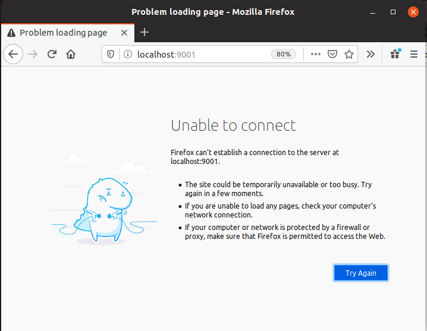
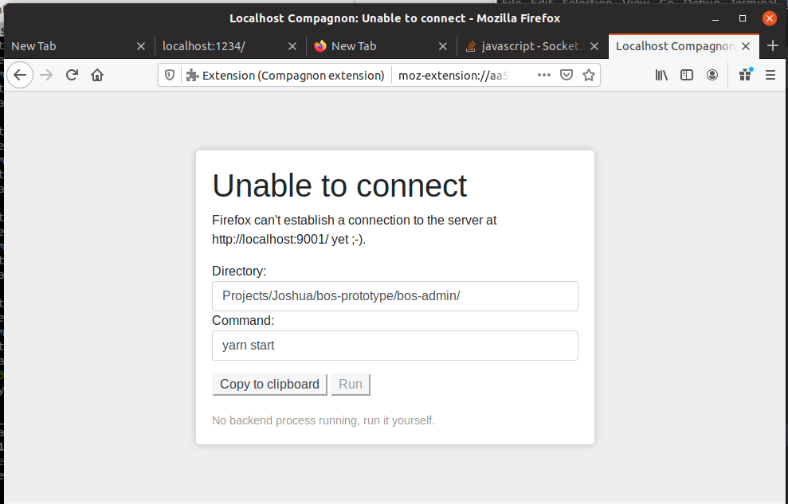
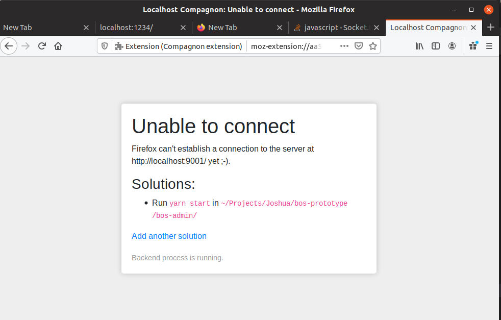
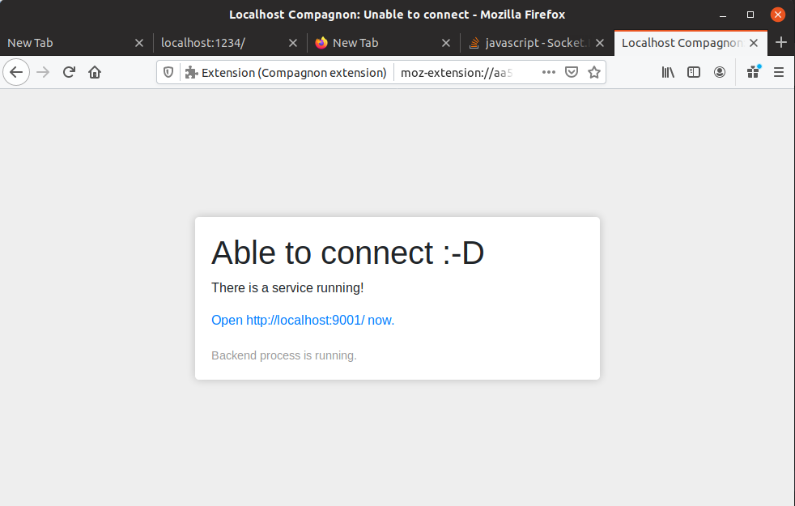

# Localhost browser extension

Handle `unable to connect` errors on localhost
in an elegant way. 

## Unable to connect

When developing locally we are probably starting,
stopping and restarting services a lot. A lot of 
times we'll open the browser, navigate to our 
service and be confronted with the fact that we've
forgotten to start it first.

No more! The localhost browser extension allows you
to capture the solution to start the server, without
having to switch focus.

It will remember the solutions so the next time 
you won't have to:

Click the appropriate solution on be on your way!

## Running commands from the browser
Browsers won't allow us to run arbitrary commands (anymore), which is probably a good thing. 

The extension by default will allow you to copy-paste
commands so you can execute them in your terminal.

If you want a more streamlined experience, it is possible to start the localhost-compagnon (probably npm install -g browser-compagnon-socketserver). The browser extension(s) will be able to connect to your localhost via WebSockets and be able to run commands.

Please be aware of the fact that opening a WebSocket server that accepts connections and commands to be executed on your machine may be extremily dangerous, and is not recommended.

Some of the security measures we may implement:
- The socket server will be started manually by the
user. The operations that the socket server executes
are visible to the user.
- Browser extensions must identify themselves. The Socket server will check a whitelist, the socket server may interact with the user to allow/deny certain extensions from connecting. 
- We may include a whitelist of commands / directories
that may be executed. whitelisting may also occur interactively. 
- There may be frequent exchange of tokens.

## Todos:
- [done] The Socket server should be made into a standalone
  utility that can be installed via npm install -g.
- [done] A good name for the socket server must be found (= flextension-server).
- [done] Security measures must be implemented to prevent abuse.  (some have been implemented)
- This extension may be used WITH or WITHOUT the compagnon socket server.
- Solutions will either be saved in $HOME/.localhostrc or inside the browser (localstorage)

